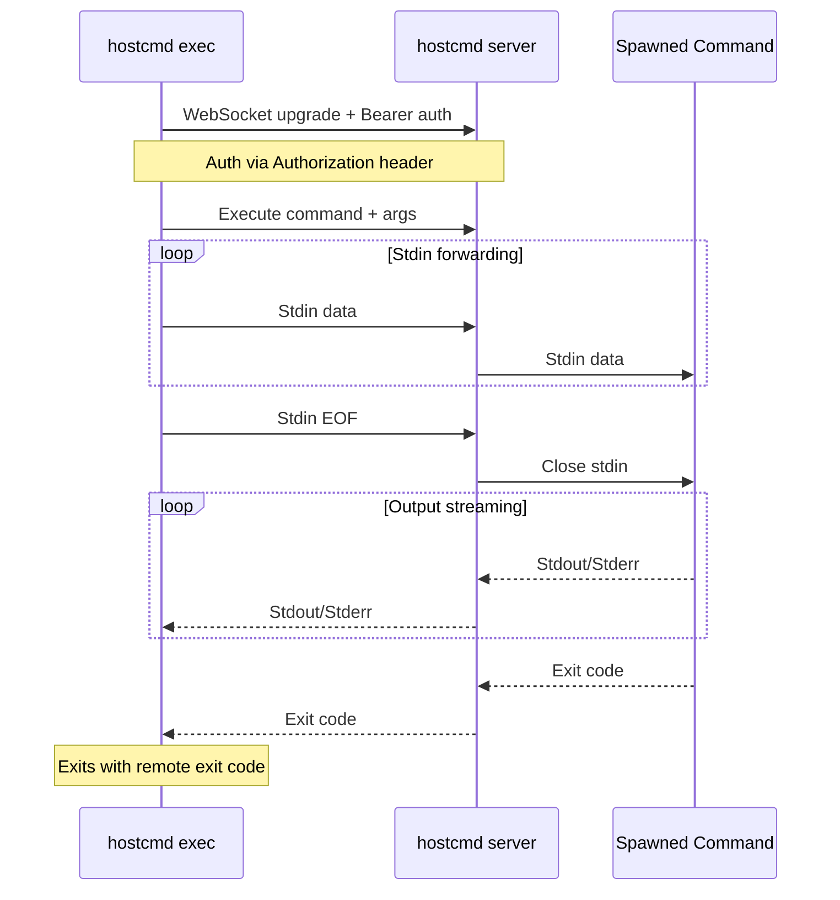

# hostcmd

Execute commands on a remote host over an authenticated WebSocket connection.

Primary use case: You are using ssh remote development with VSCode or Zed and
want to execute commands on the host running VSCode/Zed UI. For example to copy
things to clipboard with `pbcopy`. Ex. start the server on macOS and execute the
client on your linux devbox.

Features:

- stdin/stdout/stderr streaming
- command allow listing
- build-in daemon mode
- easy ssh port-forwarding with `--ssh-forward`

## Quick Start

```sh
# Start a server
hostcmd server --secret s3cret --port 8080 --host 127.0.0.1

# Execute a command through it
hostcmd exec --secret s3cret --port 8080 --host 127.0.0.1 uname -a
```

## Install

Download [latest release](https://github.com/esamattis/hostcmd/releases/latest) binary to `~/.local/bin` with:

```sh
bash -c "$(curl -fsSL https://raw.githubusercontent.com/esamattis/hostcmd/refs/heads/main/scripts/bin-install.sh)"
```

## Architecture

The client initiates a WebSocket connection to the server's `/ws` endpoint,
authenticating via a shared secret passed in the `Authorization: Bearer <secret>`
HTTP header during the upgrade request. If the secret is invalid the server
rejects the upgrade with HTTP 401 — a successful connection implies
authentication passed.

Once connected, the client sends an `Exec` frame containing the command and
arguments to run. The server spawns the command and begins streaming: stdin data
flows from client to server to the spawned process, while stdout and stderr are
streamed back to the client. When the process exits, the server sends the exit
code and the client terminates with the same code.




## Commands

### `hostcmd server`

Start a WebSocket command execution server.

```sh
hostcmd server --secret <secret> --port <port> --host <host> [OPTIONS]
```

#### Flags

| Flag | Env | Description |
|------|-----|-------------|
| `--secret <secret>` | `HOSTCMD_SECRET` | Required. Shared secret for client authentication. |
| `--port <port>` | `HOSTCMD_PORT` | Required. TCP port to listen on. |
| `--host <host>` | `HOSTCMD_HOST` | Required. Host address to bind to. |
| `--log-file <file>` | `HOSTCMD_LOG_FILE` | Optional. File that receives server log output instead of stdout. |
| `--pid-file <file>` | `HOSTCMD_PID_FILE` | Optional. File that receives the running server process id. |
| `--daemon` | - | Optional. Start the server in the background as a daemon process. |
| `--ssh-forward <hostname>` | `HOSTCMD_SSH_FORWARD` | Optional. SSH hostname for reverse port forward (runs `ssh <hostname> -R <port>:<host>:<port> -N -o ExitOnForwardFailure=yes`; server exits if SSH exits). |
| `--ssh-forward-port <port>` | `HOSTCMD_SSH_FORWARD_PORT` | Optional. SSH port used with `--ssh-forward` (adds `-p <port>` to the `ssh` command). |
| `--allow <cmd>` | `HOSTCMD_ALLOW` | Optional. Command names allowed for remote execution (repeatable). |

`--pid-file` defaults to `~/.local/share/hostcmd/server.pid`.

When `--daemon` is used and no `--log-file` is set, logs are written to `~/.local/share/hostcmd/server.log`.

The `--ssh-forward` flag starts an SSH reverse port forward alongside the server. The server runs `ssh <hostname> -R <port>:<host>:<port> -N -o ExitOnForwardFailure=yes`, making the server reachable from the remote SSH host. The server and SSH process are coupled: if the SSH process exits for any reason (connection drop, authentication failure, remote shutdown), the server exits immediately as well. Use `--ssh-forward-port` to specify a non-default SSH port (adds `-p <port>` to the command).

The `--allow` flag can be repeated to allow multiple commands. Via the environment variable, use comma-separated values: `HOSTCMD_ALLOW=pbcopy,uname`. When any allow rule is set, the server rejects commands whose executable name is not listed.

#### Examples

```sh
# Foreground server
hostcmd server --secret my-secret --port 8080 --host 127.0.0.1

# Daemon with SSH forwarding and restricted commands
hostcmd server --secret my-secret --port 8080 --host 127.0.0.1 \
  --daemon --ssh-forward MY_HOST --ssh-forward-port 2222 --allow pbcopy --allow uname
```

---

### `hostcmd exec`

Execute a command through a remote WebSocket server.

```sh
hostcmd exec --secret <secret> --port <port> --host <host> [--] <command> [args...]
```

#### Flags

| Flag | Env | Description |
|------|-----|-------------|
| `--secret <secret>` | `HOSTCMD_SECRET` | Required. Shared secret for authenticating with the server. |
| `--port <port>` | `HOSTCMD_PORT` | Required. TCP port to connect to. |
| `--host <host>` | `HOSTCMD_HOST` | Required. Host address to connect to. |
| `[--] <command> [args...]` | `HOSTCMD_COMMAND` | Required. Command and arguments to execute on the server. |

Stdin is forwarded to the remote command. Stdout and stderr are mirrored locally. The exit code of the remote command becomes the exit code of `hostcmd exec`.

Pressing Ctrl-C sends a cancellation request to the server and exits with code 130.

#### Examples

```sh
# Run a command
hostcmd exec --secret my-secret --port 8080 --host 127.0.0.1 uname -a

# Pipe stdin to the remote command
echo -n "copy me" | hostcmd exec --secret my-secret --port 8080 --host 127.0.0.1 pbcopy

# Using environment variables
export HOSTCMD_SECRET=my-secret HOSTCMD_PORT=8080 HOSTCMD_HOST=127.0.0.1
hostcmd exec ls -la
```

---

### `hostcmd stop`

Stop a daemon server using its pid file.

```sh
hostcmd stop [OPTIONS]
```

#### Flags

| Flag | Env | Description |
|------|-----|-------------|
| `--pid-file <file>` | `HOSTCMD_PID_FILE` | Optional. File that contains the daemon server process id. |

`--pid-file` defaults to `~/.local/share/hostcmd/server.pid`.

Use `--pid-file` when the daemon was started with a custom pid file path.

---

## Flag-Free Usage

Every flag (except `--daemon`) has a corresponding environment variable. Export them once and run commands without any flags:

```sh
export HOSTCMD_SECRET=my-secret
export HOSTCMD_PORT=8080
export HOSTCMD_HOST=127.0.0.1
export HOSTCMD_SSH_FORWARD_PORT=2222
```

Then the server and client commands reduce to:

```sh
hostcmd server --daemon
hostcmd exec uname -a
echo "hello" | hostcmd exec pbcopy
hostcmd stop
```

This is especially useful when `hostcmd exec` is invoked by other tools that are unaware of the connection details.


## Exec Process Environment Variables

Commands spawned by the server receive these additional environment variables:

| Variable | Value | Description |
|----------|-------|-------------|
| `HOSTCMD_CLIENT_HOSTNAME` | Client's hostname | Hostname of the machine that initiated the execution request |
| `HOSTCMD_CLIENT_EXEC` | `true` | Marker indicating the command was launched through hostcmd |


## AI disclosure

Yes, this project was made with the help of AI agents.
